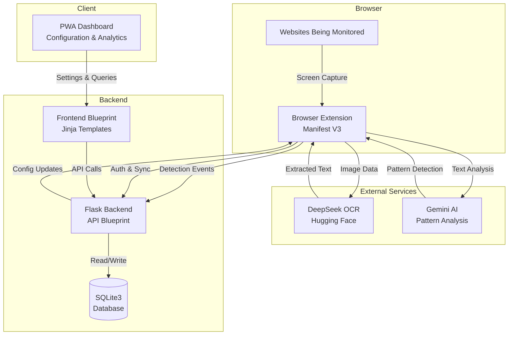

# Design Document: ShieldUI

## Overview

ShieldUI is a comprehensive browser protection system consisting of three main components: a Manifest V3 browser extension, a Progressive Web App dashboard, and a Flask-based backend server. The system uses DeepSeek OCR and Gemini AI to detect dark patterns and prevent doomscrolling behavior across websites.

The architecture follows a client-server model where the browser extension acts as a monitoring agent, the backend server handles authentication and data persistence, and the dashboard provides user configuration and analytics visualization. All components communicate through RESTful APIs with secure authentication.

## Architecture

### High-Level Architecture



### Component Responsibilities

**Browser Extension (ShieldUI_Extension)**:
- Monitors webpage content and user scrolling behavior
- Captures screen content at configurable intervals
- Communicates with OCR and AI services
- Displays warnings and interventions to users
- Syncs with backend server for settings and logging

**Backend Server (Backend_Server)**:
- Handles user authentication (Passkey + TOTP)
- Manages API endpoints for extension and dashboard
- Persists detection logs and user settings
- Aggregates analytics data
- Pushes configuration updates to extensions

**PWA Dashboard (ShieldUI_Dashboard)**:
- Provides authentication interface
- Displays analytics and detection history
- Allows configuration of detection sensitivity and thresholds
- Functions offline with service worker caching
- Syncs changes when connectivity restores

**External Services**:
- DeepSeek OCR extracts text from screen captures
- Gemini AI analyzes text for dark pattern indicators

## Components and Interfaces

### Backend Server Structure

```
backend/
├── app.py                    # Flask application factory
├── config.py                 # Configuration management
├── models.py                 # SQLAlchemy database models
├── blueprints/
│   ├── api/
│   │   ├── __init__.py      # API blueprint registration
│   │   ├── auth.py          # Authentication endpoints
│   │   ├── detection.py     # Detection logging endpoints
│   │   ├── settings.py      # Settings management endpoints
│   │   └── analytics.py     # Analytics query endpoints
│   └── frontend/
│       ├── __init__.py      # Frontend blueprint registration
│       ├── routes.py        # Dashboard page routes
│       └── templates/       # Jinja2 templates
│           ├── base.html
│           ├── login.html
│           ├── dashboard.html
│           ├── settings.html
│           └── analytics.html
├── services/
│   ├── auth_service.py      # Passkey and TOTP logic
│   ├── ocr_service.py       # DeepSeek OCR integration
│   └── ai_service.py        # Gemini AI integration
└── utils/
    ├── crypto.py            # Encryption utilities
    └── validators.py        # Input validation
```

### Browser Extension Structure

```
extension/
├── manifest.json            # Manifest V3 configuration
├── background.js            # Service worker for background tasks
├── content.js               # Content script for page monitoring
├── popup/
│   ├── popup.html
│   └── popup.js
├── services/
│   ├── capture.js           # Screen capture logic
│   ├── detector.js          # Pattern detection coordination
│   └── sync.js              # Backend synchronization
└── utils/
    ├── storage.js           # Local storage management
    └── api.js               # API communication helpers
```

### API Endpoints

**Authentication API** (`/api/auth`):
- `POST /api/auth/register/passkey` - Initiate passkey registration
- `POST /api/auth/register/totp` - Setup TOTP for user
- `POST /api/auth/login` - Authenticate with passkey and TOTP
- `POST /api/auth/logout` - Invalidate session token
- `GET /api/auth/session` - Validate current session

**Detection API** (`/api/detection`):
- `POST /api/detection/log` - Log dark pattern detection event
- `POST /api/detection/doomscroll` - Log doomscrolling intervention
- `GET /api/detection/recent` - Retrieve recent detections

**Settings API** (`/api/settings`):
- `GET /api/settings` - Retrieve user settings
- `PUT /api/settings` - Update user settings
- `GET /api/settings/sync` - Get settings version for sync

**Analytics API** (`/api/analytics`):
- `GET /api/analytics/summary` - Get detection summary statistics
- `GET /api/analytics/patterns` - Get pattern type breakdown
- `GET /api/analytics/websites` - Get most problematic websites
- `GET /api/analytics/timeline` - Get detection timeline data

**Frontend Routes** (`/`):
- `GET /` - Dashboard home (requires auth)
- `GET /login` - Login page
- `GET /register` - Registration page
- `GET /settings` - Settings page (requires auth)
- `GET /analytics` - Analytics page (requires auth)

## Data Models

### User Model

```python
class User:
    id: int (primary key)
    username: str (unique, indexed)
    passkey_credential: bytes (encrypted)
    totp_secret: str (encrypted)
    created_at: datetime
    last_login: datetime
    settings_version: int
```

### Settings Model

```python
class Settings:
    id: int (primary key)
    user_id: int (foreign key to User)
    dark_pattern_sensitivity: float (0.0-1.0)
    doomscroll_time_threshold: int (seconds)
    enabled_websites: json (list of domains)
    intervention_style: str (enum: gentle, moderate, strict)
    updated_at: datetime
```

### DetectionLog Model

```python
class DetectionLog:
    id: int (primary key)
    user_id: int (foreign key to User)
    url: str (indexed)
    pattern_type: str (indexed)
    confidence_score: float
    detected_at: datetime
    page_elements: json (affected elements)
```

### DoomscrollLog Model

```python
class DoomscrollLog:
    id: int (primary key)
    user_id: int (foreign key to User)
    url: str (indexed)
    scroll_duration: int (seconds)
    intervention_triggered: bool
    user_response: str (enum: continued, break, closed)
    logged_at: datetime
```

### Session Model

```python
class Session:
    id: int (primary key)
    user_id: int (foreign key to User)
    token: str (unique, indexed)
    expires_at: datetime
    created_at: datetime
```

## Correctness Properties


A property is a characteristic or behavior that should hold true across all valid executions of a system—essentially, a formal statement about what the system should do. Properties serve as the bridge between human-readable specifications and machine-verifiable correctness guarantees.

### Authentication Properties

**Property 1: Two-factor authentication requirement**
*For any* registered user attempting to login, both passkey authentication and valid TOTP code must be successfully verified before granting access.
**Validates: Requirements 1.3**

**Property 2: Failed passkey rejection**
*For any* login attempt with failed passkey authentication, the system must reject the attempt and create a failure log entry.
**Validates: Requirements 1.4**

**Property 3: Invalid TOTP rejection**
*For any* login attempt with invalid or expired TOTP code, the system must reject the attempt and prevent session creation.
**Validates: Requirements 1.5**

**Property 4: Session token creation**
*For any* successful authentication, a secure session token with appropriate expiration must be created and returned.
**Validates: Requirements 1.6**

### OCR Pipeline Properties

**Property 5: Screen capture intervals**
*For any* loaded webpage with monitoring enabled, screen captures must occur at the user-configured interval.
**Validates: Requirements 2.1**

**Property 6: OCR transmission**
*For any* captured screen image, the image data must be transmitted to the OCR service.
**Validates: Requirements 2.2**

**Property 7: Text extraction**
*For any* image received by the OCR service, structured text data must be extracted and returned.
**Validates: Requirements 2.3**

**Property 8: OCR retry with backoff**
*For any* OCR processing failure, the system must log the error and retry with exponentially increasing delays.
**Validates: Requirements 2.4**

**Property 9: AI analyzer handoff**
*For any* successfully completed OCR extraction, the extracted text must be passed to the AI analyzer.
**Validates: Requirements 2.5**

### Dark Pattern Detection Properties

**Property 10: Pattern analysis invocation**
*For any* extracted text received by the AI analyzer, analysis for dark pattern indicators must be performed.
**Validates: Requirements 3.1**

**Property 11: Comprehensive pattern detection**
*For any* text containing urgency manipulation, misdirection, social proof manipulation, or obstruction patterns, the AI analyzer must detect and classify the pattern type.
**Validates: Requirements 3.2, 3.3, 3.4, 3.5**

**Property 12: Detection result structure**
*For any* detected dark pattern, the returned result must include pattern type, confidence score, and affected page elements.
**Validates: Requirements 3.6**

**Property 13: Visual warning display**
*For any* completed dark pattern detection with positive result, visual warnings must be displayed to the user.
**Validates: Requirements 3.7**

**Property 14: Detection logging**
*For any* detected dark pattern, a log entry must be created containing timestamp, URL, pattern type, and confidence score.
**Validates: Requirements 3.8**

### Doomscrolling Prevention Properties

**Property 15: Platform-specific scroll monitoring**
*For any* configured doomscrolling-prone website (Instagram Reels, YouTube Shorts, TikTok, Twitter, Reddit), scrolling behavior must be monitored and infinite-scroll patterns detected.
**Validates: Requirements 4.1, 4.4**

**Property 16: Scroll metrics tracking**
*For any* detected infinite-scroll content feed, scroll depth and time spent must be tracked.
**Validates: Requirements 4.2**

**Property 17: Threshold-based intervention**
*For any* scroll session where time spent exceeds the user-configured threshold, an intervention overlay must be displayed.
**Validates: Requirements 4.3**

**Property 18: Intervention options**
*For any* triggered intervention, the user must be presented with options to continue, take a break, or close the tab.
**Validates: Requirements 4.5**

**Property 19: Intervention dismissal logging**
*For any* dismissed intervention, a log entry must be created containing timestamp and user response.
**Validates: Requirements 4.6**

**Property 20: Per-website time configuration**
*For any* user with doomscrolling prevention enabled, time limit configuration must be available on a per-website basis.
**Validates: Requirements 4.7**

### Synchronization Properties

**Property 21: Extension startup authentication**
*For any* extension startup, authentication with the backend server must be attempted using stored credentials.
**Validates: Requirements 5.1**

**Property 22: Settings push synchronization**
*For any* settings change made in the dashboard, update notifications must be pushed to all connected extensions.
**Validates: Requirements 5.2**

**Property 23: Detection event transmission**
*For any* pattern detection by the extension, a detection event must be sent to the backend server.
**Validates: Requirements 5.3**

**Property 24: Analytics data aggregation**
*For any* analytics request from the dashboard, detection logs must be retrieved and aggregated from the database.
**Validates: Requirements 5.4**

**Property 25: Offline event queueing**
*For any* network connectivity loss, detection events must be queued locally and synchronized when connection is restored.
**Validates: Requirements 5.5**

### Configuration Properties

**Property 26: Settings display completeness**
*For any* user accessing the settings page, configuration options for both dark pattern detection sensitivity and doomscrolling time thresholds must be displayed.
**Validates: Requirements 6.1, 6.2**

**Property 27: Settings input validation**
*For any* settings modification, input values must be validated before saving to the database.
**Validates: Requirements 6.3**

**Property 28: Settings persistence round-trip**
*For any* valid settings object, saving to the database and then retrieving should produce an equivalent settings object.
**Validates: Requirements 6.4**

**Property 29: Extension configuration notification**
*For any* saved settings change, all connected extensions must receive configuration update notifications.
**Validates: Requirements 6.5**

### Analytics Properties

**Property 30: Analytics completeness**
*For any* user accessing the analytics page, the display must include total patterns detected over time, pattern type breakdown with frequencies, doomscrolling statistics, and most problematic websites ranked by detection frequency.
**Validates: Requirements 7.1, 7.2, 7.3, 7.4**

**Property 31: Analytics date filtering**
*For any* analytics request, data aggregation must apply the specified date range filter.
**Validates: Requirements 7.5**

### PWA Properties

**Property 32: Installation prompt**
*For any* dashboard access on a supported browser, an installation prompt must be displayed.
**Validates: Requirements 8.3**

**Property 33: Offline functionality**
*For any* installed PWA instance without network connectivity, cached analytics and settings must remain viewable.
**Validates: Requirements 8.4**

**Property 34: Reconnection synchronization**
*For any* network connectivity restoration, pending changes must be synchronized with the backend server.
**Validates: Requirements 8.5**

### Security Properties

**Property 35: Sensitive data encryption**
*For any* sensitive user data stored in the database, the data must be encrypted using secure encryption algorithms.
**Validates: Requirements 9.1, 9.2**

**Property 36: API rate limiting**
*For any* API endpoint, rate limiting must be enforced to prevent abuse.
**Validates: Requirements 9.3**

**Property 37: Input sanitization**
*For any* user input before database operations, validation and sanitization must be performed.
**Validates: Requirements 9.4**

**Property 38: Complete data deletion**
*For any* user data deletion request, all associated records must be removed from the database.
**Validates: Requirements 9.5**

## Error Handling

### Authentication Errors

**Invalid Credentials**: When passkey or TOTP validation fails, return HTTP 401 with descriptive error message. Log the failure with timestamp and attempted username (not credentials).

**Expired Sessions**: When a session token expires, return HTTP 401 and require re-authentication. Clear the expired session from the database.

**Rate Limiting**: When authentication attempts exceed rate limits, return HTTP 429 with retry-after header. Implement exponential backoff for repeated violations.

### OCR and AI Service Errors

**Service Unavailability**: When external services (DeepSeek OCR, Gemini AI) are unavailable, log the error and retry with exponential backoff (initial delay: 1s, max delay: 60s, max retries: 5).

**Invalid Responses**: When services return malformed data, log the error with request/response details and skip the current analysis cycle.

**Timeout Errors**: When service requests exceed timeout thresholds (OCR: 10s, AI: 15s), cancel the request and retry with backoff.

### Database Errors

**Connection Failures**: When database connections fail, attempt reconnection with exponential backoff. Queue write operations in memory (max 100 items) until connection restores.

**Constraint Violations**: When unique constraints are violated, return HTTP 409 with specific field information.

**Transaction Failures**: When transactions fail, rollback all changes and return HTTP 500 with generic error message (log detailed error server-side).

### Extension Errors

**Capture Failures**: When screen capture fails (permissions, browser limitations), log the error and skip the current capture cycle. Display user notification if failures persist.

**Storage Quota**: When local storage quota is exceeded, remove oldest queued events (FIFO) to make space for new events.

**Sync Failures**: When synchronization with backend fails, maintain local queue and retry on next sync interval (default: 60s).

## Testing Strategy

### Unit Testing

Unit tests will verify specific examples, edge cases, and error conditions for individual components:

**Authentication Tests**:
- Test passkey registration with valid WebAuthn credentials
- Test TOTP setup with valid secret generation
- Test login rejection with invalid TOTP codes
- Test session token expiration handling
- Test rate limiting enforcement

**OCR Pipeline Tests**:
- Test screen capture with various viewport sizes
- Test OCR service integration with sample images
- Test retry logic with simulated failures
- Test text extraction with empty/malformed images

**Dark Pattern Detection Tests**:
- Test pattern detection with known dark pattern examples
- Test confidence score calculation
- Test logging with various pattern types
- Test warning display rendering

**Doomscrolling Tests**:
- Test scroll tracking with simulated scroll events
- Test threshold calculation with various time limits
- Test intervention display with different user responses
- Test platform-specific detection for each supported site

**Database Tests**:
- Test model creation and retrieval
- Test constraint enforcement
- Test encryption/decryption of sensitive fields
- Test cascade deletion

**API Tests**:
- Test endpoint authentication requirements
- Test request validation and sanitization
- Test response formatting
- Test error handling for each endpoint

### Property-Based Testing

Property-based tests will verify universal properties across all inputs using a Python property testing library (Hypothesis for backend, fast-check for extension JavaScript):

**Configuration**: Each property test must run minimum 100 iterations to ensure comprehensive input coverage.

**Test Tagging**: Each property test must include a comment tag referencing the design document property:
```python
# Feature: shield-ui, Property 28: Settings persistence round-trip
```

**Property Test Implementation**:

- **Property 1-4 (Authentication)**: Generate random user credentials, authentication attempts, and verify two-factor requirements, rejection behavior, and session creation
- **Property 5-9 (OCR Pipeline)**: Generate random webpage states, capture intervals, and verify capture timing, transmission, and handoff behavior
- **Property 11 (Pattern Detection)**: Generate random text samples with and without dark patterns, verify detection across all pattern types
- **Property 12 (Detection Structure)**: Generate random detection results, verify all required fields are present
- **Property 14 (Detection Logging)**: Generate random detections, verify log entries contain all required fields
- **Property 15-20 (Doomscrolling)**: Generate random scroll sessions, thresholds, and verify monitoring, tracking, and intervention behavior
- **Property 21-25 (Synchronization)**: Generate random sync events, network states, and verify authentication, push updates, and offline queueing
- **Property 26-29 (Configuration)**: Generate random settings objects, verify display, validation, persistence round-trip, and notifications
- **Property 30-31 (Analytics)**: Generate random detection logs, verify aggregation completeness and date filtering
- **Property 32-34 (PWA)**: Generate random browser states, network states, and verify installation prompts, offline access, and sync
- **Property 35-38 (Security)**: Generate random user data, inputs, and verify encryption, rate limiting, sanitization, and deletion

**Testing Libraries**:
- Backend (Python): Hypothesis for property-based testing, pytest for test runner
- Extension (JavaScript): fast-check for property-based testing, Jest for test runner

**Integration Testing**: Integration tests will verify end-to-end flows across components:
- Complete authentication flow from registration to login
- Complete detection flow from capture to logging
- Complete sync flow from dashboard settings change to extension update
- Complete analytics flow from detection to dashboard display

Both unit tests and property-based tests are essential for comprehensive coverage. Unit tests catch specific bugs and validate concrete examples, while property tests verify general correctness across all possible inputs.
